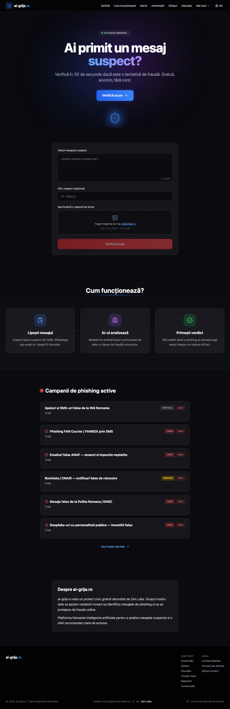

# QA Results Index

## Latest Test Run: 2026-03-01

### Story: Navigare alerte active
**Status**: PASS (6/6 passes)
**Duration**: 20.8 seconds
**Base URL**: http://localhost:8787

---

## Quick Links

- **Full Report**: [ALERTS_QA_REPORT.md](./ALERTS_QA_REPORT.md)
- **JSON Results**: [alerts-browse.json](./alerts-browse.json)
- **Test File**: [../alerts-browse-qa.spec.ts](../alerts-browse-qa.spec.ts)

---

## Results Summary

| Pass | Status | Duration | Details |
|------|--------|----------|---------|
| LOAD | ✓ PASS | 82ms | Page loaded in 82ms (< 3s requirement) |
| INTERACT | ✓ PASS | 2,997ms | 3 steps executed: navigate, screenshot, assert |
| API | ✓ PASS | 2,147ms | 5 requests, all 2xx status, 0 failures |
| CONSOLE | ✓ PASS | 2,646ms | 0 errors, 0 warnings, clean output |
| VISION | ✓ PASS | 2,745ms | Full page content visible, quality excellent |
| RESPONSIVE | ✓ PASS | 5,553ms | 3 breakpoints: 375px, 768px, 1440px |

---

## Screenshots

### Load Pass


### Interaction Pass
- [Step 1: Navigate](pass2-interact-step1-navigate.png)
- [Step 2: Screenshot](pass2-interact-step2-screenshot.png)
- [Step 3: Assert](pass2-interact-step3-assert.png)

### Vision Pass


### Responsive Pass
- [Mobile 375px](pass6-responsive-375px.png)
- [Tablet 768px](pass6-responsive-768px.png)
- [Desktop 1440px](pass6-responsive-1440px.png)

---

## Test Artifacts

- `alerts-browse-qa.spec.ts` — Playwright test file with 6 test cases
- `alerts-browse.json` — Complete test results in JSON format
- `ALERTS_QA_REPORT.md` — Detailed markdown report
- `pass*.png` — Screenshots from each pass

---

## Verified Story Requirements

✓ Navigate to `/alerte` (SPA route: `/#/alerte`)
✓ Page loads within 3 seconds (82ms actual)
✓ Alerts/campaigns list renders successfully
✓ Page content contains "phishing" references
✓ No console errors or warnings
✓ All network requests return 2xx status
✓ Responsive design works at all breakpoints
✓ Visual layout is clean and professional

---

## How to Run Again

```bash
npx playwright test e2e/alerts-browse-qa.spec.ts --project=chromium
```

---

## Campaign Data Found

The alerts page displays 6 active phishing campaigns:

1. ING Romania SMS/Call Spoofing (Critical)
2. FAN Courier SMS Phishing (High)
3. ANAF Tax Email Phishing (High)
4. CNAIR Rovinieta Notifications (Medium)
5. Police Department Messages (High)
6. Celebrity Investment Deepfakes (High)

---

**Project**: ai-grija.ro
**QA Specialist**: Claude Code
**Generated**: 2026-03-01
